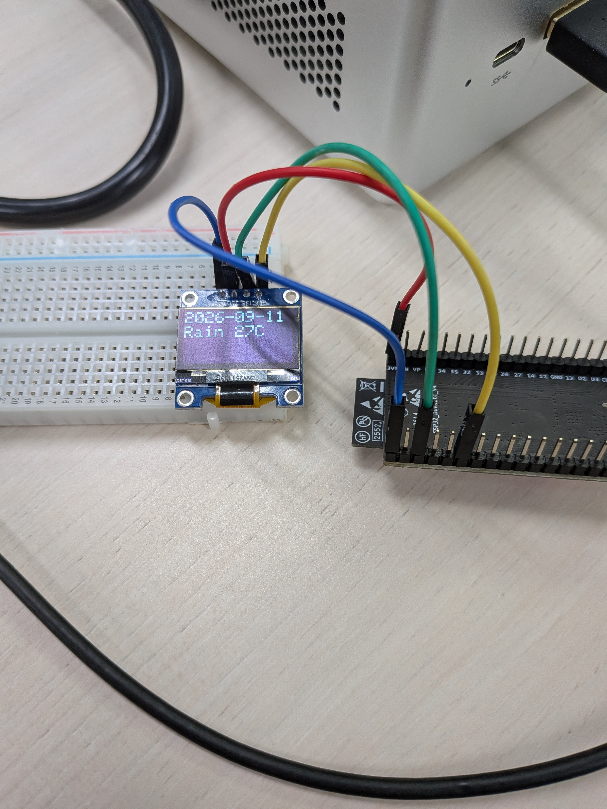

# ESP32 OLED Weather Display



ESP32で天気予報APIから天気を取得し、128×64 SSD1306 OLEDに表示するシンプルなサンプルです。

Wi-Fi接続、HTTP通信、JSON解析、I2C OLED表示を一つのプロジェクトで体験できます。

## Demo

* 天気予報をWi-Fi経由で取得
* 今日・明日・明後日の3日分を表示
* 1秒ごとに表示を切り替え
* 30分ごとに天気情報を更新

## Hardware

* ESP32 DevKitC-32E
* SSD1306 OLED (128×64, I2C)

### Wiring

| OLED | ESP32  |
| ---- | ------ |
| VCC  | 3.3V   |
| GND  | GND    |
| SDA  | GPIO21 |
| SCL  | GPIO22 |

## Libraries

Arduino IDEで以下をインストールしてください。

* Adafruit SSD1306
* Adafruit GFX Library
* ArduinoJson

## Wi-Fi設定

`wifi_config.h` を作成します。

```cpp
#define WIFI_SSID "YOUR_WIFI_SSID"
#define WIFI_PASSWORD "YOUR_WIFI_PASSWORD"
```

## API

以下の天気予報APIを利用しています。

* Tsukumijima Weather API（静岡県浜松市西部）

取得したJSONを `ArduinoJson` で解析してOLEDへ表示します。

## Display Example

```text
9/14

Sunny
32C
```

3日分の天気を順番に表示します。

## Features

* Wi-Fi接続
* HTTP GET通信
* JSON解析
* SSD1306 OLED表示
* 30分ごとの自動更新

## Directory

```text
ESP32-OLED-Weather/
├── ESP32-OLED-Weather.ino
├── wifi_config.h      // Wi-Fi情報（Git管理しない）
└── README.md
```

## License

MIT License
